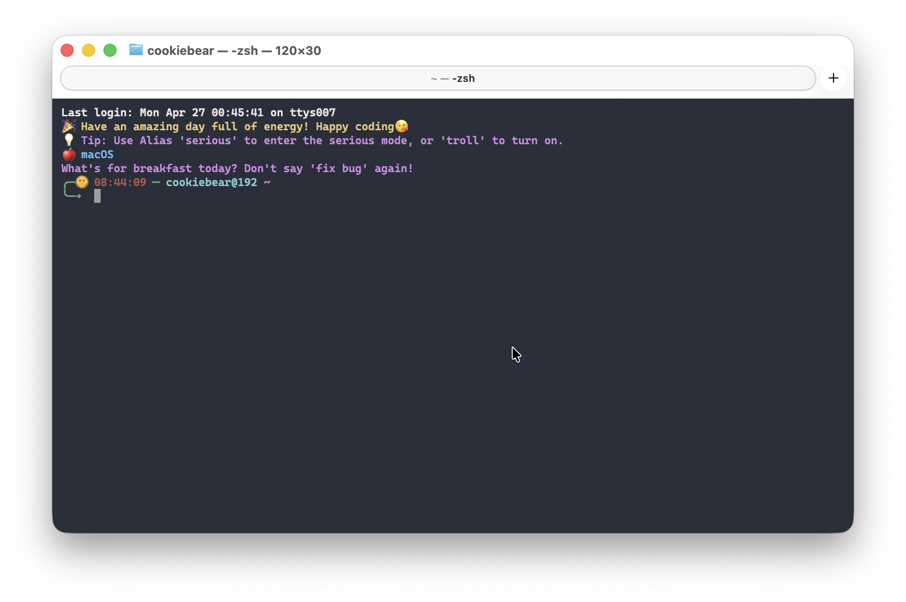

# Zsh Buddy Theme

Your coding buddy — a motivational Zsh theme with work-life balance reminders, multi-language support, and a touch of humor.

[](https://opensource.org/licenses/MIT)
[](https://www.zsh.org/)
[](https://github.com/hieudnm/zsh-buddy-theme)

## ✨ Features

- 🌍 **Multi-language support** (Vietnamese, English) with easy extension system
- 🕐 **Time-based buddy messages** with special overtime reminders (17:30-18:30)
- ⚡ **Command-specific responses** for Git, Docker, npm, Python, and 50+ commands
- 🎨 **Dynamic prompt** with time icons, git status, virtual environment info
- 📱 **System detection** (WSL, macOS, Windows, Linux)
- ⚙️ **Configurable** language settings via config file or environment variables
- 🔄 **Auto-setup** - automatically creates required directories and default files
- 💬 **70+ contextual messages** for different times and commands

## 🚀 Quick Start

### One-Line Install (Recommended)

```bash
bash <(curl -sf https://raw.githubusercontent.com/hieudnm/zsh-buddy-theme/main/install.sh)
```

The installer will automatically:
- Detect your OS (macOS / Linux / WSL / Windows)
- Install Zsh if not present
- Download all theme files
- Install Nerd Font
- Set Zsh as default shell

### Manual Install

<details>
<summary>Click to expand manual installation steps</summary>

1. **Install Zsh** (if not already installed):
   - macOS: `brew install zsh`
   - Ubuntu/Debian: `sudo apt install zsh`
   - Windows (MSYS2): https://packages.msys2.org/packages/zsh

2. **Download theme files:**
   ```bash
   curl -sf -o ~/.zshrc https://raw.githubusercontent.com/hieudnm/zsh-buddy-theme/main/.zshrc && mkdir -p "$HOME/.troll_themer/lang"
   ```
   ```bash
   curl -sf -o "$HOME/.troll_themer/config" https://raw.githubusercontent.com/hieudnm/zsh-buddy-theme/main/.troll_themer/config
   ```
   ```bash
   curl -sf -o "$HOME/.troll_themer/lang/vi.txt" https://raw.githubusercontent.com/hieudnm/zsh-buddy-theme/main/.troll_themer/lang/vi.txt && curl -sf -o "$HOME/.troll_themer/lang/en.txt" https://raw.githubusercontent.com/hieudnm/zsh-buddy-theme/main/.troll_themer/lang/en.txt
   ```

3. **Set Zsh as default and restart terminal:**
   ```bash
   chsh -s $(which zsh)
   ```

</details>

After installation, restart your terminal and enjoy! 🎉

## 🌍 Language Configuration

### Method 1: Environment Variable (Recommended)
```bash
export TROLL_LANG="en"  # English
export TROLL_LANG="vi"  # Vietnamese (default)
```

### Method 2: Configuration File

The theme automatically creates `.troll_themer/config`:

```bash
# Available languages: vi (Vietnamese), en (English)
TROLL_LANG="vi"
```

## 🔇 Serious Mode

Sometimes you need to focus without the trolling. The theme includes a **serious mode** that temporarily disables all troll messages:

### Quick Mode Switching

```bash
# Enable serious mode (disable trolling)
serious
# or
export TROLL_MODE="serious"

# Back to troll mode (enable trolling)
troll
# or
unset TROLL_MODE

# Check current mode
mode-status
```

### Use Cases

- **Important presentations** - No unexpected messages during demos
- **Pair programming** - Professional environment with colleagues
- **Learning/tutorials** - Clean output when following tutorials
- **Production debugging** - Focus on serious troubleshooting

**Example:**

```bash
$ serious
🔇 Serious mode activated. Trolling disabled.

$ git commit -m "Fix critical bug"
# No troll messages, clean output

$ troll  
🎭 Troll mode activated. Let the fun begin!

$ git push
Push thành công rồi, nghỉ xíu uống miếng nước người đẹp!
```

## 📁 Project Structure

```
zsh-buddy-theme/
├── .zshrc                   # Main theme file
├── .troll_themer/           # Configuration & resources directory
│   ├── config               # Language configuration file
│   ├── font/                # Included font
│   │   └── CaskaydiaMonoNerdFontMono-SemiBold.ttf
│   └── lang/                # Language packs directory
│       ├── vi.txt           # Vietnamese messages
│       └── en.txt           # English messages
├── version.txt              # Theme version
├── install.sh               # One-line installer script
├── preview.png              # Theme preview screenshot
├── LICENSE                  # MIT License file
└── README.md                # This documentation
```

## � Message Categories

| Category | Count | Description |
|----------|-------|-------------|
| `welcome` | 1 | Welcome message on theme load |
| `update_*` | 2 | Update and repository messages |
| `overtime` | 30 | Work-life balance reminders (17:30-18:30) |
| `hour_*` | 24 | Time-specific messages for each hour |
| `cmd_*` | 57 | Command-specific responses |

### Supported Commands
Git, Docker, npm, yarn, Python, pip, system commands (ls, cd, mv, cp, rm), text editors (vim, nano), system monitoring (htop, ps, df, free), and many more!

## �️ Adding New Languages

1. **Create a language file:**
   ```bash
   touch .troll_themer/lang/your_lang.txt
   ```

2. **Follow the format:**
   ```
   # Your Language Pack for Zsh Buddy Theme
   # Format: category:message

   welcome:🎉 Welcome message in your language
   overtime:Work late message
   hour_08:Morning message
   cmd_git_commit:Git commit response
   ```

3. **Set your language:**
   ```bash
   export TROLL_LANG="your_lang"
   ```

## 🎨 Theme Preview



## ⚙️ Configuration Options

### Custom User Config (Preserved During Updates)

Add your custom PATH, aliases, exports, and other config **at the end** of `.zshrc`, after the `ZSH_BUDDY_THEME_END` marker:

```bash
# === ZSH_BUDDY_THEME_END ===
# Everything below this line is preserved during theme updates.
# Add your custom PATH, aliases, exports, and other config here.

export PATH="/usr/local/bin:$PATH"
alias ll="ls -la"
export MY_API_KEY="..."
```

When you run `update`, the theme code above the marker is replaced with the new version, but everything below it is **automatically preserved**.

### Environment Variables

- `TROLL_LANG` - Set preferred language (vi, en, or custom)
- `TROLL_MODE` - Set to "serious" to disable trolling temporarily
- `THEME_NAME` - Customize theme name in welcome message

### Files

- `.troll_themer/config` - Main configuration file
- `.troll_themer/update` - Update check timestamp
- `.troll_themer/lang/*.txt` - Language message files

## 🔧 Requirements

- **Zsh 5.0+** - The theme is built for Zsh shell
- **UTF-8 terminal** - For proper emoji and Vietnamese character display
- **Git** (optional) - For git status display in prompt

### 🎨 Recommended Font

**We highly recommend using [Nerd Fonts](https://www.nerdfonts.com/) for the best experience:**

- **Free and open source** - Completely free to use
- **Rich character support** - Includes powerline symbols, icons, and Vietnamese characters
- **Beautiful display** - Makes your terminal look professional and modern
- **Wide compatibility** - Works with all major terminals and operating systems

#### 📁 Included Font (Ready to Use!)

**This theme includes a pre-configured font in the project:**

- **Cascadia Code Nerd Font Mono (SemiBold)** - Located in `.troll_themer/font/`
- **Perfect for this theme** - Optimized for Vietnamese characters and symbols
- **No additional download needed** - Just install the font file directly

**Installation from project folder:**

```bash
# Windows: Double-click the font file to install
# Or copy to: C:\Windows\Fonts\

# Linux/Ubuntu:
sudo cp .troll_themer/font/CaskaydiaMonoNerdFontMono-SemiBold.ttf /usr/share/fonts/
sudo fc-cache -fv

# macOS:
cp .troll_themer/font/CaskaydiaMonoNerdFontMono-SemiBold.ttf ~/Library/Fonts/
```

#### 🌐 Alternative Popular Choices

- [JetBrains Mono Nerd Font](https://github.com/ryanoasis/nerd-fonts/tree/master/patched-fonts/JetBrainsMono) - Clean, modern coding font
- [Fira Code Nerd Font](https://github.com/ryanoasis/nerd-fonts/tree/master/patched-fonts/FiraCode) - Popular with programming ligatures
- [Hack Nerd Font](https://github.com/ryanoasis/nerd-fonts/tree/master/patched-fonts/Hack) - Designed specifically for source code

**Download alternatives:**

```bash
# Download and install any Nerd Font from:
# https://www.nerdfonts.com/font-downloads

# For Ubuntu/Debian:
sudo apt install fonts-powerline

# For macOS:
brew tap homebrew/cask-fonts
brew install font-jetbrains-mono-nerd-font
```

### Optional Enhancements

- [zsh-autosuggestions](https://github.com/zsh-users/zsh-autosuggestions) - Command suggestions
- A powerline-compatible font for better prompt display

## 🐛 Troubleshooting

**Theme not loading?**

- Ensure you're using Zsh: `echo $SHELL`
- Check file permissions: `ls -la .zshrc`

**Messages not displaying?**

- Verify language files exist: `ls .troll_themer/lang/`
- Check language setting: `echo $TROLL_LANG`

**Encoding issues?**

- Ensure terminal supports UTF-8
- Try: `export LANG=en_US.UTF-8`

## 🤝 Contributing

Contributions are welcome! Here's how you can help:

1. **Add new languages** - Create language packs for your locale
2. **Improve messages** - Make the trolling funnier or more relevant
3. **Add new commands** - Extend command-specific responses
4. **Bug fixes** - Report and fix issues

### Development Setup

```bash
git clone https://github.com/hieudnm/zsh-buddy-theme.git
cd zsh-buddy-theme
# Test your changes
source .zshrc
```

## 📜 License

This project is licensed under the MIT License - see the [LICENSE](LICENSE) file for details.

## � Acknowledgments

- Inspired by the Vietnamese developer community's love for humor and code
- Built with ❤️ for developers who enjoy a bit of trolling with their terminal
- Special thanks to all contributors and users

---

**Made with 💻 and ☕ by [hieudnm](https://github.com/hieudnm)**

*"Code smarter, laugh harder!"* 😄
